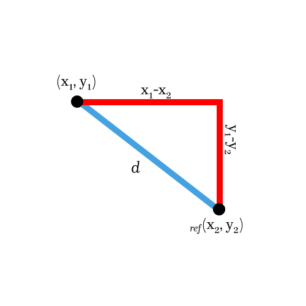

## Oscilloscope

This is a open source converter for video/image formats
to be converted to audio, specifically audio that can be played
back on an oscilloscope in X/Y mode (or on a [simulator](https://dood.al/oscilloscope/))
so that the original media will once again be displayed

### Overview
- [Why make this?](#why)
- [Intentions](#intentions)
- [How it works](#how-it-works)
- [Algorithm](#algorithm)
- [Examples](#examples)

#### Why?

This was a project originally made for a class, post-presentation I cleaned it up to
put it here :)

[**Back to overview**](#overview)

#### Intentions

The whole reason for this being open source is so that hopefully if anyone wants to do something in similar they have something to go off of.
I fully recognize this project could be improved upon, especially in it's efficiency as generation times tends to grow a lot as more points are added.

The time-complexity of this is best represented through O(n log n)
-- (Where n is equal to the number of points)

formally,

[**Back to overview**](#overview)

#### How it works

The converter works by taking in a path to an image or video
and opens it using python-opencv, to convert it into a numpy array.

After this compression and noise reduction are applied to limit the available points,
this then undergoes a path calculation on it to draw an outline of the frame/image.

The now edge map will be processed as (x, y) points on a cartesian plane and treated as such
from here on.

A reference point is assigned (this will be the last point in the edge map)
and the a modified DFS algorithm will sort all the other points by how close it is
in proximity to the reference point. This process is repeated.

The list of all visited (sorted) points then have translations applied to them to get it in terms of -1.0 <= y <= 1.0
(amplitude of a wave) and they are then recombined into a stereo waveform using numpy's column stack.

After this conversion to audio data, depending on the media form, the points will sped up to reach the correct frame rate to
smooth out the playback when there are a lot of points, and for images the duration passed into the class will be taken into account
and audio data will be looped to reach this duration (making a solid image displayed for _x_ seconds).

[**Back to overview**](#overview)

#### Algorithm

This project uses a modified DFS algorithm to accomplish a clean sort of points,
as in traditional DFS algorithms most points have defined neighbours, whereas in this case they do not, as disconnected points
can exist.

The algorithm starts very similar to a normal one except for that the stack (queue)
will be sorted by the algorithm everytime, to compensate for the loss of neighbours.

Every iteration of the algorithm it will get all x and y values and compute distance (using pythagoras adapted for distance)
away from the reference point it will set the queue to this new sorted list.

Below is a picture of the pythagoras distance calculation:

[**Back to overview**](#overview)

## Examples

To break it down a little farther you can use the example file `examples/circle.py` to generate a cosine and sine wave in the left and right channel,
which when in X/Y mode, will create a circle.

For a visual representation see the diagram below.

[**Back to overview**](#overview)
